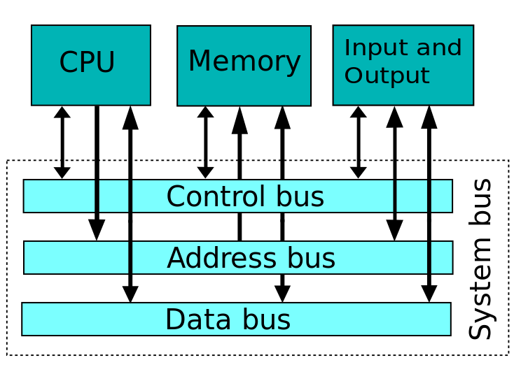

# RAM

Considered to be a FRU (Field Replaceable Unit)

Random Access Memory - Any part of the memory can be accessed at any time

Each byte has an address, and consists of 8 bits (with each bit a 1 or 0)

* 32-bit vs 64-bit memory address
* Dynamic random access memory (DRAM). Capacitors serve as storage, but needs to be periodically refreshed
* Note: static RAM (SRAM) is typically used for cache memory in the CPU. Needs constant flow of power

## Memory Controller

* Traditionally located in the northbridge
* If there is the correct signal from the control bus, it will read the address from the address bus and output that value to the data bus (or store from the data bus to that address)

## DRAM Sticks

### SIMM

Pins present on either facet are connected

Must be loaded in matched pairs

### DIMM

Pins on opposite sides are not connected (twice as many possible contacts)

Can be loaded one-at-a-time

### SO-DIMM

Small-outline DIMM

Used in Laptops

### Memory Channels

Some motherboards have Dual-channel memory, allowing two DIMMS to be used together, speeding up memory

This usually is indicated by color on the DIMM slots

## SDRAM

The RAM is tied to the system clock, so the CPU and MCC knows exactly when the data is ready to go

### DDR SDRAM

Double data rate SDRAM

Doubles the throughput of SDRAM by making two processes for every clock cycle

## Types of DDR

There is a variety of types - DDR, DDR2, DDR3, DDR3L/DDR3U, DDR4, each with their own speeds and throughputs

## Latency

How long it takes to retrieve the data once requested. Lower latency is better.

Represents how many cycles of the system clock it takes before the RAM responds. Speeding up the system clock may result in more cycles for the RAM (since the RAM doesn't speed up)

Not as important with DDR4 as it was with DDR2 and DDR3

## Parity and ECC

Occasionally, a bit will flip in your RAM, and this can cause unexpected results - a crash or worse

### Parity

Error checking - an extra bit is stored, when it was read, the flip of a single bit would detect as an error

### ECC

Error correction code RAM (ECC RAM)

It can detect and correct most errors

Commonly used in servers where downtime is bad

# Working with RAM

## How much do you need?

RAM is the system's working memory, parts of programs are loaded for fast access

Many programs loaded mean much RAM usage, what happens when you run out?

While more memory doesn't speed things up, less memory can certainly slow you down

### Virtual Memory

Windows uses a **page file** to store portions of less used memory to your mass storage. Linux uses a **swap partition** to to the same.

If your hard drive is working very hard without you writing or reading to it, you're likely out of memory. This is called **disk thrashing**. Perhaps install more RAM

I recommend at least double the Windows requirements. More if you plan to run virtual machines, or lots of processor-intensive work.

# Troubleshooting RAM

* Page fault - a program requests an address in virtual memory, not currently loaded in RAM. A hardware interrupt halts the execution of that thread until it is loaded from mass storage. Usually this is not noticed, but can result in a hang or crash

* Non-maskable interrupt (NMI) - an interrupt the CPU cannot ignore, usually resulting in a Blue Screen of Death (BSoD), or Spinning Pinwheel of Death (SPoD)

Windows Memory Diagnostic, or Memtest86+ can be used to test your RAM
