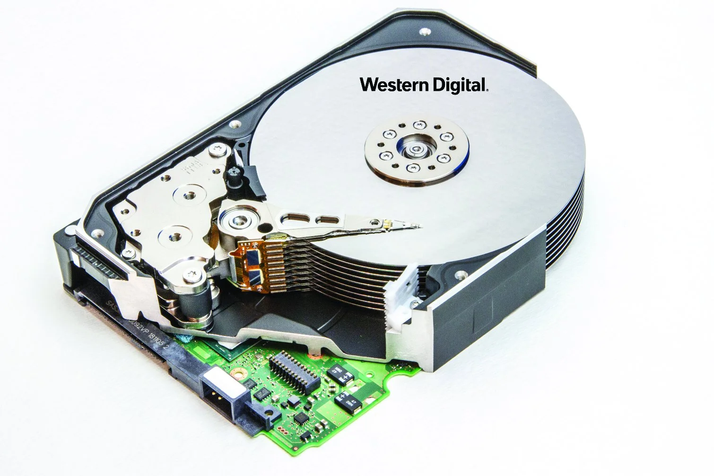
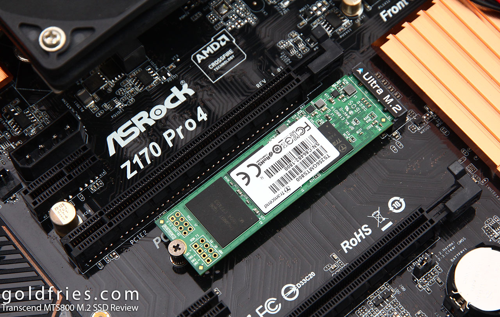

# Mass storage - Ch 8

## Magnetic Hard Drives

* Hard Disk Drive (HDD)

* Data is stored magnetically on several spinning disks

  * Can be damaged by vibration/shock (not a good choice for laptops)

  

* Actuator arm moves a read/write head (this is the source of the clicking noise)

Spindle Speed

* 3600, 5400, 7200 RPM
* Faster speed generally means faster read/write
  * Require more energy
  * Creates more heat

Form Factors

* 2.5-inch or 3.5-inch

## Solid-State Drives (SSD)

Uses nonvolatile flash memory such as NAND ROM

No moving parts

Form Factors

* 2.5-inch
* mSATA
* M2 drives connected over NVMe (Non-volatile memory express), connecting directly to PCIe
  * Key B, Key M, or Keys B+M support mass storage
  * Key A and Key E are used in wireless networking devices

## Comparing: Spinning vs Solid

SSDs cost more, though not as bad as it used to be

Sequential read/write

* Measured in throughput (MBps)- transferring large files. Most drives read a little faster than they write
* Typical speeds:
  * 200 MBps for HDD
  * 600 MBps for SSD attached via SATA
  * 2500 MBps or faster for NVMe attached SSD

Random Read/Write

* Measured in input/output operations per second (IOPS). Many small transfers - more representative of normal use
* Typical speeds:
  * 150 IOPS for a traditional HDD
  * Hundreds of thousands of IOPS for a NVMe SSD

Latency

* How quickly it responds to a single request, usually expressed in milliseconds (ms) or microseconds (μs)
  * Hard drives are typically under 20 ms
  * SSDs are typically under 1 ms

## The best of both worlds?

Hybrid Hard Drives (HHDs)

* Combine flash memory as a cache for speed with spinning platters for capacity
* In reality, they're not very popular

# Connecting Mass Storage

* Advanced Technology Attachment (ATA)
* Parallel ATA (PATA)

  * Large ribbon cables, sometimes referred to as IDE cables (impede airflow)
  * Can't be hot-swapped
  * Up to two drives per cable, but they must be arranged as master/slave
  * 40 wires normally, with an 80 wire variant
  * Generally not in use
* Serial ATA (SATA)

  * Fewer wires, longer maximum wire length
  * Direct connection between mass storage device and SATA controller, called the Host Bus Adapter (HBA)
  * One drive per port
  * Faster than PATA - 1.5Gbps, 3Gbps, and 6Gpbs varieties
* SATAe

  * SATA express - direct connection to PCIe lane (recall that PCIe can move 16 Gbps (2 GBps)

* eSata

  * External SATA - make use of the fact that SATA is hot-swappable
  * Not as popular since USB 3.0

* SCSI

  * Chain up to 16 devices together
  * Used to need a terminator, but now is automatically configured
  * Each device uses a unique SCSI ID

    * 0 - 15
    * Logical units (LUNs) are defined within a SCSI ID

      * A multi-drive enclosure gets a SCSI ID, and separate drives get a LUN

  * Serial attached SCSI (SAS) devices have no jumpers, terminators, or settings

    * Point-to-point
    * More commonly used in servers and drive arrays

Advanced Host Controller Interface (AHCI)

* Needs to be enabled in BIOS
* An efficient way to work with SATA HBAs
  * Unlocks Command Queuing and Hot-swapping

## Data Redundancy

* Write the same data to two drives
  * Mirroring (Both drive connected to same RAID controller)
  * Duplexing (Two RAID controllers)
    * Marginally faster than mirroring (and safer)
* Disk striping - spread data across multiple drives to speed up read/write
  * Risky
* Disk striping with parity - Parity stripe stored so if one drive fails, data can be recovered
  * At least 3 drives, commonly more

Redundant Array of Inexpensive Disks (RAID)

* RAID 0 - Disk Striping. Requires at least two drives (not redundant)
* RAID 1 - Disk Mirroring/Duplexing. Requires at least two drives
* RAID 5 - Disk Striping with Distributed Parity. Requires at least three drives
* RAID 6 - Disk Striping with Extra Parity. Requires at least 4 drives
* RAID 10 (or 1+0) - Nested, Striped Mirrors. Requires at least 4 drives
  * Mirror then stripe
  * Speed of striping with reliability of mirroring (4x read, 2x write)
  * RAID 0
    * RAID 1
      * Drive 1
        * B1
        * B3
        * B5
      * Drive 2
        * B1
        * B3
        * B5
    * RAID 1
      * Drive 3
        * B2
        * B4
        * B6
      * Drive 4
        * B2
        * B4
        * B6
* RAID 0+1 - Nested, Mirror Stripes
  * Start with stripes and create mirrors
  * Performance: Read x4, write x2
  * RAID 1
    * RAID 0
      * Drive 1
        * B1
        * B3
        * B5
      * Drive 2
        * B2
        * B4
        * B6
    * RAID 0
      * Drive 3
        * C1
        * C3
        * C5
      * Drive 4
        * C2
        * C4
        * C6
* Hardware vs Software RAIDS
  * Windows allows Software RAIDS in Disk Management, and Storage Spaces
  * ZFS
  * Unraid
  * TrueNAS

# Mass Storage Maintenance and End-of-life

S.M.A.R.T. (Self-Monitoring, Analysis, and Reporting Technology)

* An internal drive program that tracks errors and error conditions within the drive

Physical destruction

Recycling/repurposing

* Low-level vs standard format

* overwrite

* drive wipe

