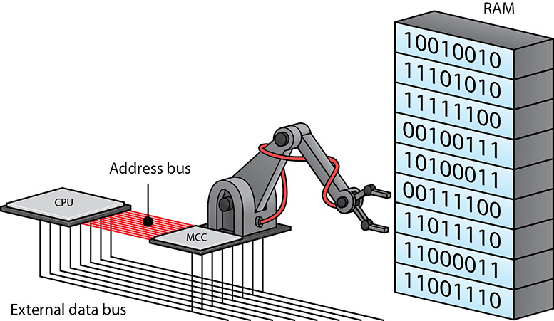

# CPU

A CPU has registers - small pieces of memory

* In an 8086, these are 2 bytes each
* General purpose: AX, BX, CX, DX
* SI - source index
* DI destination index
* BP base pointer
* SP stack pointer

There is also a stack - a piece of memory designed to store data in a FIFO manner (an inbox where you always grab from the top)

There may also be a heap, where data can be placed and in any order

A CPU consist of circuitry to be able to react to certain instructions

* The list of all possible instructions is called an instruction set
* Depending on the architecture, this instruction set varies. Examples: 8086, Risc-V, ARM
* Example instructions of the 8086 architecture (assembly), from https://www.tutorialspoint.com/microprocessor/microprocessor_8086_instruction_sets.htm
  * **MOV** − Used to copy the byte or word from the provided source to the provided destination.
  * **PPUSH** − Used to put a word at the top of the stack.
  * **POP** − Used to get a word from the top of the stack to the provided location.
  * **PUSHA** − Used to put all the registers into the stack.
  * **POPA** − Used to get words from the stack to all registers.
  * **XCHG** − Used to exchange the data from two locations.
  * **ADD** − Used to add the provided byte to byte/word to word.
  * **XOR** − Used to perform Exclusive-OR operation over each bit in a byte/word with the corresponding bit in another byte/word.
  * **CALL** − Used to call a procedure and save their return address to the stack.
  * **RET** − Used to return from the procedure to the main program.
* MOV AX, 0B800h; set AX to hexadecimal value of B800h
* ADD BX, AX; add AX to BX
* RET; return to calling method
* Actual instructions are transmitted as 1s and 0s

Instructions take a certain number of cycles, and the time per cycle is determined by the clock

* The clock wire is a signal that goes on and off at a regular interval - driven by the quartz oscillator
  * 1 Hz = 1 cycle per second
  * 1 megahertz (1 MHz) = 1 million cycles per second
  * 1 gigahertz (1 GHz) = 1 billion cycles per second
* Many instructions take multiple cycles to execute
* On different architecture, a similar instruction may take a different number of cycles
  * Comparing the speed of two processors is not as straight forward as comparing their clock speed

## Address Bus

RAM can load any value, but we need an address.

* 32-bit address can access 2^32 locations (4GB)
  * 32-bit systems are generally referred to as x86 (Program Files (x86))
  * 32-bit programs can generally be run by 64-bit CPUs (but not the other way)

* 64-bit address can access 2^64 locations (16EiB)
  * KB, MB, GB, TB, PB, EB, ZB, YB

* Values are loaded from DRAM to closer, faster versions of RAM called SRAM (CPU cache), with even closer and faster versions beyond that.
  * L1 is generally the smallest cache, with L3 being the largest and slowest cache
  * Technically, an Integrated memory controller (IMC) is now on the CPU for the ability to access cache

## Additional Features

Virtualization support

* In order to run more than one operating system simultaneously, we use virtualization
  * Must be enabled in the BIOS
  * Enables use of hypervisors like VirtualBox, Hyper-V, or VMWare

Pipelining

* If an instruction takes 4 cycles, utilize various parts constantly instead of waiting
  * Fetch
  * Decode
  * Execute
  * Write
* Analogy, when doing laundry, each piece of laundry must be washed, then dried, then folded, and finally put away
  * To pipeline is to start the second load of laundry washing while the first is drying, then start the third load washing while the first is being folded and the second is drying, etc.
* The CPU needs to keep track of dependencies, pipeline stalls can happen
  * Multiple pipelines enable the CPU to stay busy

Parallel Execution

* Multiple processor cores working simultaneously

Multithreading/multiple cores

* Instead of giving a large workload to a single core, split the work into multiple threads that can be given to different cores
* Programs must be written to take advantage of multiple threads

Hyper-threading: multiple threads given to a single core (to utilize time that would otherwise be spent idle)

* Can increase performance by up to 30% in server applications

Example CPUs

* The AMD Ryzen 5 5600X has 3MB L2 Cache, 32MB L3 Cache, 6 cores, and 12 threads, 3.7GHz for $267
* The Intel Core i7 11th Gen has 16 MB L3 Cache, 8 cores, and 16 threads, 3.6GHz for $349

Graphics Processing Unit (GPU)

* Similar to a CPU, but the instructions are specialized for graphics operations rather than general purpose
* Able to do many parallel operations simultaneously
* Many CPUs have onboard graphics, or a GPU built into the CPU
  * If you're trying to save money, this is a good way to avoid buying a dedicated graphics card

## NX bit

Prevents execution of data stored in certain memory - this helps protect against malware

* Intex - XD bit (eXecute Disable)
* AMD - Enhanced Virus Protection
* ARM - XN (eXecute Never)

# Installing a CPU

## Socket type

* Land Grid Array (LGA) - Like the Intel Core i3, i5, i7 series

* Pin Grid Array (PGA) - LIke AMD Ryzen

* Be careful not to bend any pins - don't touch them, and don't put anything else on them
* These sockets are called zero insertion force (ZIF) sockets
* Lift the retaining arm, align the CPU, place it (no pressure), and replace the retaining arm (requires some pressure)

## Cooling

* Add thermal paste (about the size of a pea) between CPU and cooling solution
  * Too little means not good contact - poor heat transfer
  * Too much means too much distance - poor heat transfer
  * Many heat sinks come with thermal paste already applied - just remove the tape that is protecting it first (if present)
* OEM CPU coolers - you know they'll work, but they may be pretty cheap
* Specialized CPU coolers - be sure it works with your socket type
  * Large fans with low RPM for very low noise (Noctua)
  * Heat pipes to transport heat
  * Liquid cooling by pumping liquid next to cpu, then disappating heat in a radiator
* Plug fan into CPU fan power header on motherboard

## Overclocking

* By increasing the clock multiplier and the voltage supplied to your CPU, you can achieve a faster computer
* Increased heat output
* Instability issues - system lockups, reboots, and unexpected shutdowns
* Utilities to help
  * Intel Extreme Tuning Utility (Intel XTU)
  * AMD Overdrive Utility

## Troubleshooting

Lockup shortly after powering on, or lockup when under heavy load - Probably overheating

Sudden crash without being to start again, or even a loud pop with the smell of burnt electronics or ozone - dead component - use your nose to find the source of the smell