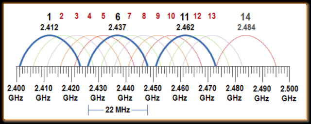

# Wifi

standards (ch 20)

protocols and encryption (ch 20)

* WEP
* WPA
* WPA2
* TKIP
* AES

Troubleshooting

* Limited connectivity
* unavailable resources
* no connectivity
* apipa/link local address
* intermittend connectivity
* ip conflict
* slow transfer speeds
* low RF signal
* SSID not found

# Other wireless technologies

bluetooth

IoT devices

cellular

zigbee

zwave

nfc, bluetooth, IR, Hotspot - Ch 24, 936

------------

# More networking concepts

Transmitting over the same medium

* Collisions
  * Multiple hosts sending at the same time
* Carrier Sense Multiple Access/Collision Detection (CSMA/CD)
  * Commonly used in Wired networks (when hubs were used)
  * Check to see if another node is currently broadcasting, if so, wait a random amount of time and check again (random backoff)
    * Those awkward conversations where you try not to interrupt but keep talking over someone
* Carrier Sense Multiple Access/Collision Avoidance (CSMA/CA)
  * Commonly used in Wireless networks
  * Uses Request to Send/Clear to Send (RTS/CTS) protocol
    * Like raising your hand and waiting to be called on

Ad Hoc Mode, sometimes called peer-to-peer mode

* Hosts connect directly with one another without any central coordinator
* Don't need a WAP

Infrastructure Mode

* Uses one or more Wireless Access Points (WAPs)
* Hosts talk through WAPs

Small office/home office (SOHO) networks

* Commonly combine the functionality of the router, switch, WAP, and sometimes the modem into a single device

# Wireless networking

### Service Set Identifier (SSID) - also called the network name

* Not a security feature, easy to spoof
* SSID can be set to not broadcast
  * Can still be determined, you just have to sniff the wireless traffic (not a security feature)

### MAC address filtering

* only devices with the correct MAC address can connect
* MAC addresses can be easily spoofed (not a security feature)

## Wireless Security Protocols and Authentication methods

Generations of wireless security: WEP, WPA, WPA2, and WPA3

### Wired Equivalent Privacy (WEP)

* It's really not
* Extremely vulnerable to attack

### Wi-Fi Protected Access (WPA)

* Intended as an interim upgrade from WEP
* Uses the Temporal Key Integrity Protocol (TKIP) - deprecated because of flaws
* Also offers Extensible Authentication Protocol (EAP)

### WPA2

* In current use
* Uses Advanced Encryption Standard (AES)
* Vulnerabilities were identified in 2020

### WPA3

* Eventual successor to WPA2
* Vulnerabilities were identified in 2021
* If security is important, don't send it over the air, or use other encryption

### Wi-Fi Protected Setup (WPS)

* Connect devices by pressing a button on the WAP and connecting within a timeframe
* Alternatively enter a 8 digits code
  * Split into two parts, 4/4, and one of those is used as an error check, so at most 10^4 + 10^3 = 11,000 tries would be needed to break in (very weak)

## 802.11-Based Wireless networking

802.11b/a/g/n/ac/ax - You will look at the differences in your assignment

* n, ac and ax are also called wifi 4, 5, and 6, respectively

The two major frequencies used: 2.4Ghz and 5Ghz (not to be confused with cellular's 5G)

2.4 Ghz is broken into 11 channels (1-11 in the US), but really only 3 should be used

* WAPs should be arranged so that there isn't interference (multiple WAPs in range with overlapping channels) - https://www.extremenetworks.com/extreme-networks-blog/2-4-ghz-channel-planning/
* Lower frequency signals are better at penetrating walls

5 Ghz 

* Has either 12 or 6 non-overlapping channels possible (depending on if the channels are 40 Mhz or 80 Mhz)

* Tends to be shorter range, with less ability to penetrate walls

Vocabulary

* Multiple in/Multiple out (MIMO) - Ability to have multiple simultaneous connections
  * Requires multiple antennas on non-hand-held devices (up to 4)
* Transmission beamforming - use multiple antennas and constructive interference to target a device (rather than sending the same data in all directions)

* Multi-user MIMO (MU-MIMO) - Connect with multiple users simultaneously
* Orthogonal Frequency Division Multiple Access (OFDMA) - Subdivide a channel into subcarriers, allowing for more simultaneous devices connections (while splitting the total bandwidth)

# Other wireless standards

## Infrared

Infrared Data Association (IrDA) - transmit via infrared light

* Short range (1m)
* Not very impressive speeds (4Mbps)
* Vulnerable to interference (sunlight, or a cold beverage)

Bluetooth - your own Personal Area Network (PAN)

* Acceptable speeds for file transfers
* In the 2.4 GHz range

Cellular

